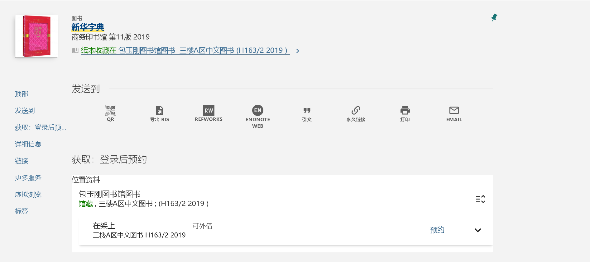

## 地理位置

上海交通大学图书馆在闵行校区的主要馆舍包括主馆、包玉刚图书馆和李政道图书馆。三座馆舍的使用侧重点有所不同：主馆馆藏门类较齐全、座位较多，适合查阅专业书籍和长时间学习；包玉刚图书馆空间较新，讨论、阅读和自习场景都比较集中，并设有 24 小时学习空间；李政道图书馆兼具图书阅览、科学史展览和档案收藏功能。

徐汇校区另有图书阅览空间、社会科学阅览室等服务点。医学院图书馆及部分院系资料室的开放和借阅规则可能相对独立，使用前建议查看对应馆舍通知。

### 主馆（2008）

- 位置：闵行校区图书信息楼，也常被称为“主图书馆”或“新图”
- 面积：服务面积约 3.5 万平方米
- 座位：近 4000 席
- 定位：综合性最强，理、工、生、医、农等学科馆藏较丰富

#### 楼层导览

- L1：入口大厅、总服务台、自助借还设备、展览空间、交图创咖等。首次借书、处理借阅异常或咨询馆藏位置时，可以优先前往总服务台。
- L2：工程技术、工具书、学位论文及综合阅读资源较集中，并分布有部分特色资源空间、研讨区域和阅览座位。
- L3：自然科学及工程技术类馆藏较集中，例如数学、物理、化学、地球科学、计算机、自动化等学科图书。
- L4：主要分布生物、医学、农业以及部分工程类馆藏，同时设有文库、特藏和综合阅览空间。

主馆内部常用 “A300”“B400” 等方式标示房间或区域。字母通常表示分区，数字一般与楼层和房间位置有关。馆藏位置会随空间调整变化，找书时应以图书馆检索系统显示的馆藏地、房间号和索书号为准，不宜只凭旧楼层图寻找。

#### 开放时间

正常教学周内，主馆阅览区域通常开放至 22:30。考试季、寒暑假、国家法定节假日和特殊活动期间，开放时间可能临时调整，前往前建议查看[上海交通大学图书馆官网](https://www.lib.sjtu.edu.cn/)、图书馆微信公众号或“交我办”中的最新通知。

#### 座位分布 & 预约情况

主馆座位数量较多，安静阅览区和综合学习区都比较集中。部分座位需要通过[座位预约系统](https://libseat.sjtu.edu.cn/)预约；系统中未显示的座位为非预约座位，先到先得。非预约座位区域会由图书馆根据实际情况动态设置，不是固定清单，具体以预约系统和现场标识为准。考试周主馆座位较紧张，建议提前预约并按时签到。

### 包玉刚图书馆（1992）

- 位置：闵行校区东部
- 面积：约 1.4 万平方米
- 座位：约 1200 席
- 总藏书量：约 93 万册
- 定位：空间较活跃，适合阅读、讨论和小组学习

#### 楼层导览

- L1：交汇。设有入口、服务台、自助借还设备、展览及公共交流空间。办理借还书或咨询馆藏位置，可优先前往一楼。
- L2：通达。以开放阅览、学习和休闲空间为主，整体氛围相对活跃。
- L3：图像。设有多样化阅读、学习和展示空间，适合使用电子设备学习或进行较轻量的交流。
- L4：书屋。以阅读和自习空间为主，环境相对安静。包玉刚图书馆联楼四楼设有 24 小时学习空间，是夜间学习较常用的地点。
- L5：川流不息。分布有书架和阅览座位，整体较为安静，适合长时间阅读。
- L6：乘风破浪。设有安静学习及其他功能空间，部分区域的开放方式可能有所不同，应以现场标识和预约系统为准。

包图不同楼层对交谈声音的容忍程度不同。需要线上会议或小组讨论时，应使用指定交流区或预约研讨间，不要在安静阅览区长时间通话。

#### 开放时间

正常教学周内，包玉刚图书馆阅览区域通常开放至 22:30。联楼四楼 24 小时学习空间一般可在闭馆后继续使用，但设备维护、消防检查、节假日安排等可能导致临时调整。

### 李政道图书馆（2014）

- 位置：闵行校区东部
- 面积：5100 平方米
- 阅览座位：约 270 个
- 定位：兼具图书馆、档案馆、科学馆、艺术馆和博物馆功能

#### 楼层导览

- -1F：报告厅，有 342 个座位，可以举办各类学术会议、报告及小型音乐会，通常不作为日常自习空间。
- 1F：“以天之语，解物之道”主题展厅，围绕李政道先生的科学成就、教育理念和艺术作品展开。
- 2F：展厅、阅览座位。参观展览与进入阅览区的开放时间可能不同。
- 3F：阅览座位、书架区、画架区、诺贝尔角、科普区、李政道藏书房和“赤子情”等多个区域。
- 4F：李政道先生办公室、CUSPEA 相关空间和档案特藏区域，部分空间不作为日常阅览区开放。

李政道图书馆需要区分阅览区域和展览区域：阅览区域通常按图书馆日常开放时间管理，展览区域可能有单独开放时段、停止入场时间和闭馆日。计划参观展览时，建议提前查看馆方通知。

## 图书借阅
**借阅规则以[图书馆官网“借阅服务”栏目](https://www.lib.sjtu.edu.cn/v2/sub/8f306c5a83f2d09f6646f5ee16fa8b9d?typeId=51ad5c84-a721143df091f5-b4eb88238659)和馆藏页面提示为准。**

- 教职工及计划内学生可外借普通图书数量不限，普通图书单次借期一般为 30 天。
- 普通图书可在到期前续借，续借次数不限，每次续借周期为 30 天。
- 续借后的借期一般从实际续借日期开始计算，而不是在原到期日之后顺延，因此没有必要过早续借。
- 已经逾期、被其他读者预约或属于短期外借的图书不能续借。
- 部分热门或特殊图书可能设为“短期外借”，借期通常为 7 天，数量、续借和预约规则以馆藏页面提示为准。
- 逾期费用：
  - 普通图书逾期费用：0.10 元/天/册（寒、暑假除外）。
  - 预约催还逾期费用：如续借期内图书被其他读者预约时，读者应按通知规定时间还书，过期未还书按预约催还逾期处理，逾期费为 1.00 元/天/册（寒、暑假除外）。
  - 短期外借图书（期限为 7 天）逾期费：1.00 元/天/册（寒暑假除外）。

个人借阅情况、到期时间和预约状态可在“交我办”图书馆服务、图书馆个人账户或[已借阅图书](http://weijieyue.lib.sjtu.edu.cn:8080/wechat/sjtu/nowlend)页面查看。系统提醒属于辅助服务，即使没有收到提醒，读者仍需自行确认应还日期。

图书馆常在世界读书日、毕业季等节点推出逾期费豁免或免逾期费还书活动。此类活动通常有明确的时间、办理地点和适用范围限制，不能替代日常按期归还；如已有逾期图书，可留意图书馆官网和微信公众号通知。

### 华师大图书馆互通互借

上海交通大学图书馆与华东师范大学图书馆已开通“互通互借”服务。交大全日制学生及教职工可通过[馆际互通共享平台](http://iic.lib.sjtu.edu.cn/login.aspx)申请入馆或借阅权限。

跨校使用时需要注意：

- 入馆与借阅是两个不同权限，需要按实际需求分别申请。
- 进馆一般通过二维码完成，申请后需要等待数据生效。
- 跨校借还书需在人工服务台刷二维码办理，自助借还机暂不支持跨校借还。
- 单次借阅上限、是否支持续借和预约、催还通知方式、数据同步延迟等以平台提示和图书所属馆规则为准。

### 预约借阅

预约借书适合以下情况：

- 图书位于另一校区或另一馆舍；
- 图书当前已被借出；
- 不希望自行到书架寻找；
- 检索系统显示图书可以预约。

基本流程如下：

1. 通过[上海交通大学图书馆聚合搜索](https://86sjt-primo.hosted.exlibrisgroup.com.cn/primo-explore/search?tab=default_tab&search_scope=book_journal&vid=book&offset=0)或图书馆官网搜索目标借阅书籍，查看馆藏状态。
2. 打开目标图书的馆藏信息，确认书目版本、馆藏地和可预约状态。
3. 在网站上提交预约申请，并选择方便前往的取书图书馆。
4. 等待“交我办”或电子邮件通知。
5. 收到到书通知后，在规定期限内前往预约书架或服务台取书。

馆员会帮你取书，只需等待通知，就可在你选定的取书图书馆的预约区借阅你想要的图书。就算人在闵行，也可以根据系统提供的选项预约借阅徐汇的书，反过来也行。尚未收到到书通知时，不要默认图书已经可以领取。

### 自助借阅
如果你十分急迫，且恰巧目标借阅书在方便前往的图书馆，也可以尝试自助借阅。

通过[上海交通大学图书馆聚合搜索](https://86sjt-primo.hosted.exlibrisgroup.com.cn/primo-explore/search?tab=default_tab&search_scope=book_journal&vid=book&offset=0)查询借阅书籍所在的地点及索书号，确认借阅书籍没有被预约且在馆。

这里以新华字典为例，可以看到，该书在包玉刚图书馆三楼A区。

那么H163/2 2019是什么，在这里不妨了解一下索书号的构成。

- 索书号
分为分类号、种次码或著者码、辅助区分号。例如这里H163就是分类号，2是种次码或著者码，2019是辅助分区号。
索书号的排列采用逐行排列的方式，即先按照分类号排列，再按照种次码或著者码排列，最后按照辅助区分号排列，其中：
  - 分类号采用小数制排列，自左至右逐一排列组成分类号的字母或数字，如K1排在K209前面，K102排在K3前面。
  - 其他号码采用整数制排列，即按照作为一个整数的大小进行排列，如K209/31排在K209/56前面，K209/5排在K209/16前面。

前往包玉刚图书馆三楼A区，找到包括H163的书架。需要注意H16后面是H161并非H17。跳跃观察书架上书的索书号，寻找H163/2附近的索书号，在此附近仔细寻找，直至找到该书。

存在一定可能找不到该书，有可能是书被图书馆里的人拿走了，亦或是刚归还，馆员还未将图书上架，也可能是图书被放错书架、正在修补整理或检索信息尚未及时更新。可以先查看相邻书架和待上架书车，再向服务台求助；如果不急，此时选择预约借阅可能是最好的解决方案。

找到书籍后，前往自助借还机或人工柜台，借阅图书。借阅完成后应核对屏幕或个人账户，确认图书已经成功登记，避免直接将未完成借阅的图书带出馆。

### 归还
大部分图书均可异馆归还，只需前往离你最近的上海交通大学图书馆归还即可。例如，在包玉刚图书馆借出的书通常可以在主馆或徐汇校区相应服务点归还。

归还后建议查看个人账户，确认图书已经从借阅列表中移除。通过自助设备归还时，如设备提示异常，应立即联系服务台，不要将图书直接留在机器旁。图书遗失、污损、缺页或被批注时，应尽快联系服务台，具体赔偿或补购方式需由馆员确认。

## 自习室预约

主馆和包玉刚图书馆设有小组学习室、研讨间等空间，适合开展课程讨论、面试、线上会议和项目协作。研讨空间一般需要提前在“交我办”或图书馆空间预约系统中申请。

使用研讨空间时，应遵守预约人数、使用时段和使用目的要求。不要将研讨间长期作为个人自习室，也不要在空间内开展可能损坏设备、产生明显气味或存在安全风险的活动。若预约后无法按时使用，应及时取消，避免影响后续预约信用。

## 座位预约

图书馆部分座位需要通过[座位预约系统](https://libseat.sjtu.edu.cn/)预约，可以从“交我办”App、图书馆主页、微信公众号或电脑端进入。具体规则可查看座位系统的[用户帮助](https://libseat.sjtu.edu.cn/#/ic/userhelp)。

- 每日 22:00 起可预约次日学习座位。
- 系统中显示的座位均需预约使用；系统中未显示的座位不需预约，先到先得。图书馆会根据实际情况动态设置不需预约的座位区域，具体以预约系统显示为准。
- 预约时间开始后，须在 30 分钟内入馆，否则系统会自动取消预约、释放座位，并计为违约。
- 从闸机刷校园一卡通、思源码或交大 V 卡入馆时，系统会自动完成签到。入馆后再预约座位时，系统会检测入馆记录并自动签到。
- 需要暂时离开座位时，应扫描座位码并选择“暂时离开”，再在离馆闸机处刷校园一卡通、思源码或交大 V 卡离馆。每次暂离可保留座位 90 分钟，暂离返回时间不得晚于预约结束时间。
- 暂离结束仍未再次签到，会取消后续预约时长、释放座位，并计为违约；未进行暂离操作直接刷卡离馆，则视为签离。
- 使用结束后应主动结束预约，不要长期占用座位。

座位信用初始为 300 分。预约后未按时签到、暂时离开未按时返回，均被计为违规；每发生 1 次违规扣除 100 分，信用分降至 0 分后暂停预约权限 2 日。馆内禁止使用书本、水杯、电脑等物品为他人占座；离开座位时，也应随身携带电脑、手机等贵重物品。

## 入馆与其他服务

进入图书馆可使用校园一卡通、思源码或交大 V 卡。开放安排、身份权限和访客入馆规则可能随时期变化，访客入馆前应以图书馆当天发布的通知为准。

在阅览区应注意保持安静，手机调至静音，不在安静阅览区接打电话；不要携带有明显气味的食物和饮料进入阅览区；不要随意移动桌椅、私接插线板或将个人物品留在馆内过夜。闭馆前应及时带走书包、电脑和复习资料，图书馆通常不会为读者保管遗留在座位上的个人物品。

馆内还提供自助打印、复印、扫描、电子资源检索、数据库使用、馆际互借和文献传递等服务。自助复印、打印、扫描一体机分布在主馆一楼自助服务区、主馆 B300 阅览室门口、包玉刚图书馆一楼大厅及四楼、五楼、四楼联楼、李政道图书馆二楼服务台、徐汇校区图书阅览空间一楼等位置；扫描通常免费，具体收费和设备状态以图书馆官网[设备使用](https://www.lib.sjtu.edu.cn/v2/sub/8f306c5a83f2d09f6646f5ee16fa8b9d?typeId=c122b519-3a3a14f9c08757-2568e8b60147)栏目及现场设备提示为准。需要门市复印、打印或装订时，可前往主馆 C110。

## 电子数据库与校外访问

图书馆订购的电子期刊、电子书、学位论文、会议论文等资源，可从[数据库 A-Z](https://www.lib.sjtu.edu.cn/engine2/shjt/data-base/list?)、[学术资源地图](https://www.lib.sjtu.edu.cn/engine2/shjt/data-base/index)或[聚合搜索](https://86sjt-primo.hosted.exlibrisgroup.com.cn/primo-explore/search?tab=default_tab&search_scope=book_journal&vid=book&offset=0)进入。

在校内网络通常可直接访问已订购资源；校外访问应使用图书馆官网公布的校外访问指引，按资源支持情况选择统一身份认证、VPN、CARSI 等方式进入，不建议从不明网站下载论文。

部分数据库有并发数、下载量、使用范围或全文延迟限制，大批量下载可能触发数据库封禁。遇到无法访问、文献缺页或链接失效时，可通过图书馆咨询渠道、文献传递或馆际互借解决。

## 常用联系方式

- 主馆总服务台：021-34206188
- 包玉刚图书馆服务台：021-54742274
- 李政道图书馆咨询电话：021-54741540

电话、开放时间和服务范围可能调整，遇到节假日、考试季或临时闭馆时，应以图书馆当天发布的通知为准。
